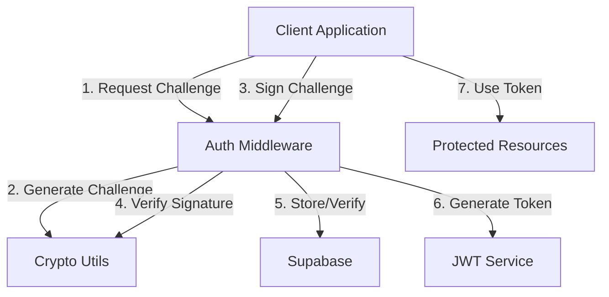

# Nostr Auth & Enrollment Middleware

A standalone, open-source middleware for handling Nostr authentication and enrollment in web applications. Built with TypeScript and designed for scalability and security.

## Features

- 🔑 NIP-07 Compatible Authentication
- 📝 Secure User Enrollment with Nostr
- ⚡ Comprehensive Event Validation
- 🔒 Advanced Cryptographic Operations
- 🗄️ Supabase Integration for Data Persistence
- 🎫 JWT-based Session Management
- 🔄 Profile Management & Synchronization
- 📊 Detailed Logging and Monitoring

## Architecture Overview



## Installation

```bash
npm install @maiqr/nostr-auth-enroll
```

## Configuration

```typescript
import { NostrAuthMiddleware } from '@maiqr/nostr-auth-enroll';

// Initialize the middleware with required configuration
const nostrAuth = new NostrAuthMiddleware({
  // Required Configuration
  supabaseUrl: process.env.SUPABASE_URL,
  supabaseKey: process.env.SUPABASE_KEY,
  jwtSecret: process.env.JWT_SECRET,
  
  // Optional Configuration
  relays: ['wss://relay.damus.io', 'wss://relay.nostr.band'],
  privateKey: process.env.SERVER_PRIVATE_KEY,  // For signing server events
  minPowDifficulty: 0,
  eventTimeoutMs: 5000,
  challengePrefix: 'nostr:auth:',
});

// Use with Express
app.use('/auth/nostr', nostrAuth.getRouter());
```

## Database Schema

### Supabase Tables

```sql
-- Nostr Enrollments
CREATE TABLE nostr_enrollments (
  pubkey TEXT PRIMARY KEY,
  enrolled_at TIMESTAMP WITH TIME ZONE DEFAULT NOW(),
  last_seen_at TIMESTAMP WITH TIME ZONE
);

-- Nostr Profiles
CREATE TABLE nostr_profiles (
  pubkey TEXT PRIMARY KEY,
  name TEXT,
  about TEXT,
  picture TEXT,
  nip05 TEXT,
  lud16 TEXT,
  updated_at TIMESTAMP WITH TIME ZONE DEFAULT NOW()
);
```

## Authentication Flow Details

1. **Challenge Request** (`POST /challenge`)
   - Client sends their public key
   - Server generates a cryptographic challenge
   - Challenge is stored with expiration

2. **Challenge Response** (`POST /verify`)
   - Client signs the challenge with their Nostr key
   - Server verifies:
     - Event format and signature
     - Challenge expiration
     - Public key ownership
   - On success, issues JWT token

3. **Protected Resource Access**
   - Client includes JWT in Authorization header
   - Middleware validates token
   - Provides access to protected routes

## Enrollment Flow Details

1. **Enrollment Request** (`POST /enroll`)
   - Client initiates with their public key
   - Server generates enrollment verification event
   - Event includes enrollment-specific tags

2. **Enrollment Verification** (`POST /enroll/verify`)
   - Client signs the enrollment event
   - Server verifies:
     - Event format and signature
     - Enrollment expiration
     - Action tags
   - Creates persistent enrollment record

## Security Implementation

### Cryptographic Operations
- Secure key pair generation using `@noble/secp256k1`
- Event signing and verification
- Challenge generation using cryptographic random bytes
- Hash generation for event IDs

```typescript
// Example of event verification
const isValid = await verifySignature(
  event.sig,
  sha256(Buffer.from(event.id, 'hex')),
  event.pubkey
);
```

### Event Validation
- Comprehensive format checking
- Timestamp validation
- Tag structure verification
- Signature verification
- Challenge response validation

### JWT Implementation
- Secure token generation
- Configurable expiration
- Payload includes public key
- Token verification middleware

## Error Handling

The middleware implements comprehensive error handling:
- Input validation errors
- Cryptographic operation failures
- Database operation errors
- Network timeouts
- Invalid signatures or formats

## Monitoring & Logging

Built-in logging with different levels:
- DEBUG: Detailed operation information
- INFO: Standard operation events
- WARN: Potential issues
- ERROR: Operation failures

## Integration Examples

### React Client
```typescript
import { NostrProvider } from '@nostr-tools/react';

function App() {
  const handleLogin = async () => {
    const challenge = await api.post('/auth/nostr/challenge', { 
      pubkey: window.nostr.getPublicKey() 
    });
    
    const signedEvent = await window.nostr.signEvent(challenge.event);
    const { token } = await api.post('/auth/nostr/verify', { 
      challengeId: challenge.id,
      signedEvent 
    });
    
    setAuthToken(token);
  };
  
  return (
    <NostrProvider>
      <button onClick={handleLogin}>Login with Nostr</button>
    </NostrProvider>
  );
}
```

### Protected API Route
```typescript
import { verifyNostrToken } from '@maiqr/nostr-auth-enroll';

app.get('/api/protected',
  verifyNostrToken(),
  async (req, res) => {
    // Access verified pubkey from token
    const { pubkey } = req.user;
    // Handle protected route logic
  }
);
```

## Contributing

We welcome contributions! Please see our [Contributing Guide](CONTRIBUTING.md) for details.

## License

MIT License - see [LICENSE](LICENSE) for details.

## Related Projects

- [nostr-tools](https://github.com/nbd-wtf/nostr-tools)
- [MaiQR.app](https://maiqr.app)
- [@noble/secp256k1](https://github.com/paulmillr/noble-secp256k1)
