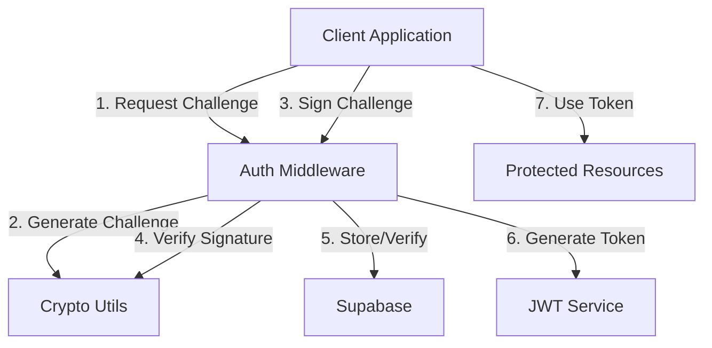

# Nostr Auth & Enrollment Middleware

[](https://github.com/HumanjavaEnterprises/nostr-auth-middleware/blob/main/LICENSE)
[](https://www.npmjs.com/package/nostr-auth-enroll)
[](https://github.com/HumanjavaEnterprises/nostr-auth-middleware/issues)
[](https://github.com/HumanjavaEnterprises/nostr-auth-middleware/stargazers)
[](https://www.typescriptlang.org/)
[](https://nodejs.org/)
[](https://makeapullrequest.com)

A standalone, open-source middleware for handling Nostr authentication and enrollment in web applications. Built with TypeScript and designed for scalability and security.

> **Important**: This middleware requires TypeScript and ES Modules. See [Good to Know](docs/good_to_know.md) for critical technical requirements and best practices.

## Features

- 🔑 NIP-07 Compatible Authentication
- 📝 Secure User Enrollment with Nostr
- ⚡ Comprehensive Event Validation
- 🔒 Advanced Cryptographic Operations
- 🗄️ Supabase Integration for Data Persistence
- 🎫 JWT-based Session Management
- 🔄 Profile Management & Synchronization
- 📊 Detailed Logging and Monitoring
- 🔐 Automatic Key Management

## Documentation

- [Complete Authentication Flow](docs/authentication-flow.md) - Detailed guide on implementing Nostr authentication
- [Good to Know](docs/good_to_know.md) - Technical requirements and best practices
- [API Reference](docs/api-reference.md) - API endpoints and usage
- [Configuration Guide](docs/configuration.md) - Environment variables and setup

## Architecture Overview



## Installation

```bash
npm install nostr-auth-enroll
```

## Quick Start

1. Clone the repository
2. Copy `.env.example` to `.env`
3. Run `./scripts/startup.sh`

The server will automatically:
- Generate server keys if none exist
- Save keys to `.env` in development mode
- Save keys to Supabase in production mode

## Configuration

### Environment Variables

Key environment variables:

```bash
# Server Keys (Auto-generated if not provided)
SERVER_PRIVATE_KEY=  # Server's private key in hex format
SERVER_PUBLIC_KEY=   # Server's public key in hex format

# Supabase (Required in production)
SUPABASE_URL=your_supabase_url
SUPABASE_KEY=your_supabase_anon_key

# Development Mode
TEST_MODE=true      # Set to false in production
```

### Key Management

The middleware supports three modes of key management:

1. **Development Mode** (default)
   - Keys are auto-generated if not found in `.env`
   - Generated keys are saved to `.env`
   - Suitable for local development

2. **Production Mode with Supabase**
   - Keys are stored in Supabase
   - Auto-generated if not found
   - Secure and scalable for production

3. **Manual Mode**
   - Provide your own keys in `.env`
   - Full control over key management
   - Suitable for custom setups

### TypeScript Configuration

```typescript
import { NostrAuthMiddleware } from 'nostr-auth-enroll';

// Initialize the middleware with required configuration
const nostrAuth = new NostrAuthMiddleware({
  // Required Configuration
  supabaseUrl: process.env.SUPABASE_URL,
  supabaseKey: process.env.SUPABASE_KEY,
  jwtSecret: process.env.JWT_SECRET,
  
  // Optional Configuration
  relays: ['wss://relay.damus.io', 'wss://relay.nostr.band'],
  privateKey: process.env.SERVER_PRIVATE_KEY,  // Auto-generated if not provided
  minPowDifficulty: 0,
  eventTimeoutMs: 5000,
  challengePrefix: 'nostr:auth:',
});

// Use with Express
app.use('/auth/nostr', nostrAuth.getRouter());
```

## Database Schema

### Supabase Tables

```sql
-- Server Keys (Production)
CREATE TABLE server_keys (
  id UUID PRIMARY KEY DEFAULT uuid_generate_v4(),
  private_key TEXT NOT NULL,
  public_key TEXT NOT NULL,
  created_at TIMESTAMP WITH TIME ZONE DEFAULT NOW()
);

-- Nostr Enrollments
CREATE TABLE nostr_enrollments (
  pubkey TEXT PRIMARY KEY,
  enrolled_at TIMESTAMP WITH TIME ZONE DEFAULT NOW(),
  last_seen_at TIMESTAMP WITH TIME ZONE
);

-- Nostr Profiles
CREATE TABLE nostr_profiles (
  pubkey TEXT PRIMARY KEY,
  name TEXT,
  about TEXT,
  picture TEXT,
  nip05 TEXT,
  lud16 TEXT,
  updated_at TIMESTAMP WITH TIME ZONE DEFAULT NOW()
);

-- Nostr Services Management
CREATE TABLE nostr_services (
  id UUID PRIMARY KEY DEFAULT uuid_generate_v4(),
  service_type TEXT NOT NULL CHECK (service_type IN ('auth', 'relay', 'file-store', 'client-app')),
  name TEXT NOT NULL,
  host TEXT NOT NULL,
  port INTEGER NOT NULL,
  public_key TEXT NOT NULL,
  private_key TEXT NOT NULL,
  status TEXT NOT NULL DEFAULT 'inactive' CHECK (status IN ('active', 'inactive', 'error')),
  last_heartbeat TIMESTAMP WITH TIME ZONE,
  config JSONB DEFAULT '{}',
  created_at TIMESTAMP WITH TIME ZONE DEFAULT NOW(),
  updated_at TIMESTAMP WITH TIME ZONE DEFAULT NOW()
);

-- Add indexes for common queries
CREATE INDEX idx_nostr_services_type ON nostr_services(service_type);
CREATE INDEX idx_nostr_services_status ON nostr_services(status);
CREATE INDEX idx_nostr_services_heartbeat ON nostr_services(last_heartbeat);

-- Example service configurations
COMMENT ON TABLE nostr_services IS 'Centralized configuration for all Nostr-related services including client apps';

INSERT INTO nostr_services (service_type, name, host, port, public_key, private_key, config) VALUES
(
  'client-app',
  'nostr-app-prod',
  'https://nostr.app',
  443,
  'client_public_key_here',
  'client_private_key_here',
  '{
    "relays": ["wss://relay.nostr.app", "wss://relay.damus.io"],
    "defaultAuthEndpoint": "https://auth.nostr.app",
    "defaultFileStore": "https://files.nostr.app",
    "features": {
      "enablePushNotifications": true,
      "enableFileSharing": true,
      "maxUploadSize": 10485760
    },
    "theme": {
      "primary": "#FF69B4",
      "secondary": "#4A90E2"
    }
  }'
);
```

### Configuration Management

The `config` JSONB field allows flexible configuration storage for different service types:

1. **Client App Config**
```typescript
interface ClientAppConfig {
  relays: string[];
  defaultAuthEndpoint: string;
  defaultFileStore: string;
  features: {
    enablePushNotifications: boolean;
    enableFileSharing: boolean;
    maxUploadSize: number;
  };
  theme: {
    primary: string;
    secondary: string;
  };
}
```

2. **Auth Service Config**
```typescript
interface AuthConfig {
  jwtExpiryHours: number;
  challengeTimeoutSeconds: number;
  allowedOrigins: string[];
}
```

3. **Relay Config**
```typescript
interface RelayConfig {
  maxSubscriptionsPerClient: number;
  maxEventsPerSub: number;
  retentionDays: number;
}
```

4. **File Store Config**
```typescript
interface FileStoreConfig {
  maxFileSize: number;
  allowedMimeTypes: string[];
  ipfsGateway: string;
}
```

### Service Discovery with Config

Extended service discovery to include configuration:

```typescript
interface ServiceEndpoint {
  host: string;
  port: number;
  config: Record<string, any>;
}

async function getServiceConfig(serviceType: string): Promise<ServiceEndpoint> {
  const { data, error } = await supabase
    .from('nostr_services')
    .select('host, port, config')
    .eq('service_type', serviceType)
    .eq('status', 'active')
    .order('last_heartbeat', { ascending: false })
    .limit(1)
    .single();

  if (error || !data) {
    throw new Error(`No active ${serviceType} service found`);
  }

  return {
    host: data.host,
    port: data.port,
    config: data.config
  };
}

// Example: Get client app configuration
async function getClientAppConfig(): Promise<ClientAppConfig> {
  const service = await getServiceConfig('client-app');
  return service.config as ClientAppConfig;
}
```

## Authentication Flow Details

1. **Challenge Request** (`POST /challenge`)
   - Client sends their public key
   - Server generates a cryptographic challenge
   - Challenge is stored with expiration

2. **Challenge Response** (`POST /verify`)
   - Client signs the challenge with their Nostr key
   - Server verifies:
     - Event format and signature
     - Challenge expiration
     - Public key ownership
   - On success, issues JWT token

3. **Protected Resource Access**
   - Client includes JWT in Authorization header
   - Middleware validates token
   - Provides access to protected routes

## Enrollment Flow Details

1. **Enrollment Request** (`POST /enroll`)
   - Client initiates with their public key
   - Server generates enrollment verification event
   - Event includes enrollment-specific tags

2. **Enrollment Verification** (`POST /enroll/verify`)
   - Client signs the enrollment event
   - Server verifies:
     - Event format and signature
     - Enrollment expiration
     - Action tags
   - Creates persistent enrollment record

## Security Implementation

### Cryptographic Operations
- Secure key pair generation using `@noble/secp256k1`
- Event signing and verification
- Challenge generation using cryptographic random bytes
- Hash generation for event IDs

```typescript
// Example of event verification
const isValid = await verifySignature(
  event.sig,
  sha256(Buffer.from(event.id, 'hex')),
  event.pubkey
);
```

### Event Validation
- Comprehensive format checking
- Timestamp validation
- Tag structure verification
- Signature verification
- Challenge response validation

### JWT Implementation
- Secure token generation
- Configurable expiration
- Payload includes public key
- Token verification middleware

## Error Handling

The middleware implements comprehensive error handling:
- Input validation errors
- Cryptographic operation failures
- Database operation errors
- Network timeouts
- Invalid signatures or formats

## Monitoring & Logging

Built-in logging with different levels:
- DEBUG: Detailed operation information
- INFO: Standard operation events
- WARN: Potential issues
- ERROR: Operation failures

## Deployment

The middleware comes with a robust deployment script that handles installation, updates, and backups.

### Deployment Script Features

- 🔄 Automatic backup rotation (keeps last 6 backups)
- ⏰ Time-based backup cleanup (removes backups older than 60 days)
- 🔒 Environment file preservation and validation
- 🚦 PM2 process management
- 🛡️ Proper file permissions and ownership

### Deployment Configuration

The deployment script uses these default paths:
```bash
DEPLOY_DIR="/opt/maiqr-nostr-auth"      # Main deployment directory
BACKUP_DIR="/opt/backups/nostr-auth"     # Backup storage
PM2_NAME="nostr-auth-middleware"         # PM2 process name
```

### Deployment Steps

1. **Initial Setup**
   ```bash
   # Clone the repository
   git clone https://github.com/maiqr/nostr-auth-middleware.git
   cd nostr-auth-middleware

   # Make the deploy script executable
   chmod +x scripts/deploy.sh
   ```

2. **Running Deployment**
   ```bash
   # Run as root or with sudo
   sudo ./scripts/deploy.sh
   ```

3. **Post-Deployment**
   - The script will automatically:
     - Backup existing deployment
     - Install dependencies
     - Build the application
     - Configure PM2
     - Set proper permissions

### Backup Management

The deployment script maintains a rolling backup system:
- Keeps the 6 most recent backups
- Automatically removes backups older than 60 days
- Validates environment files before backup
- Stores backups with proper isolation (700 permissions)

### Monitoring Deployment

After deployment, you can check the service status:
```bash
# View PM2 process status
pm2 status nostr-auth-middleware

# View logs
pm2 logs nostr-auth-middleware

# Monitor resources
pm2 monit nostr-auth-middleware
```

### Rollback Procedure

If needed, you can rollback to a previous deployment:
1. Stop the current service: `pm2 stop nostr-auth-middleware`
2. Check available backups: `ls -l /opt/backups/nostr-auth/backup_*`
3. Restore desired backup: `cp /opt/backups/nostr-auth/backup_YYYYMMDD_HHMMSS/env.backup /opt/maiqr-nostr-auth/.env`
4. Restart service: `pm2 restart nostr-auth-middleware`

## Integration Examples

### React Client
```typescript
import { NostrProvider } from '@nostr-tools/react';

function App() {
  const handleLogin = async () => {
    const challenge = await api.post('/auth/nostr/challenge', { 
      pubkey: window.nostr.getPublicKey() 
    });
    
    const signedEvent = await window.nostr.signEvent(challenge.event);
    const { token } = await api.post('/auth/nostr/verify', { 
      challengeId: challenge.id,
      signedEvent 
    });
    
    setAuthToken(token);
  };
  
  return (
    <NostrProvider>
      <button onClick={handleLogin}>Login with Nostr</button>
    </NostrProvider>
  );
}
```

### Protected API Route
```typescript
import { verifyNostrToken } from 'nostr-auth-enroll';

app.get('/api/protected',
  verifyNostrToken(),
  async (req, res) => {
    // Access verified pubkey from token
    const { pubkey } = req.user;
    // Handle protected route logic
  }
);
```

## Multi-Service Management

When running multiple Nostr services (auth, relay, file store) on the same machine, it's essential to manage them properly. Here's how to set it up:

### PM2 Ecosystem Configuration

Create an `ecosystem.config.cjs` file to manage all services:

```javascript
module.exports = {
  apps: [
    {
      name: 'nostr-auth',
      script: 'dist/index.js',
      env: {
        NODE_ENV: 'development',
        PORT: 3002,
        SERVICE_TYPE: 'auth'
      },
      env_production: {
        NODE_ENV: 'production',
        PORT: 3002,
        SERVICE_TYPE: 'auth'
      }
    },
    {
      name: 'nostr-relay',
      script: '../nostr-relay/dist/index.js',
      env: {
        NODE_ENV: 'development',
        PORT: 3000,
        SERVICE_TYPE: 'relay'
      },
      env_production: {
        NODE_ENV: 'production',
        PORT: 3000,
        SERVICE_TYPE: 'relay'
      }
    },
    {
      name: 'ipfs-nostr-store',
      script: '../ipfs-nostr-store/dist/index.js',
      env: {
        NODE_ENV: 'development',
        PORT: 3001,
        SERVICE_TYPE: 'file-store'
      },
      env_production: {
        NODE_ENV: 'production',
        PORT: 3001,
        SERVICE_TYPE: 'file-store'
      }
    },
    {
      name: 'nostr-app',
      script: '../nostr-app/dist/index.js',
      env: {
        NODE_ENV: 'development',
        PORT: 3003,
        SERVICE_TYPE: 'client-app'
      },
      env_production: {
        NODE_ENV: 'production',
        PORT: 3003,
        SERVICE_TYPE: 'client-app'
      }
    }
  ]
};
```

### Service Management Script

Create a `manage-services.sh` script for common operations:

```bash
#!/bin/bash

# Function to start all services
start_all() {
    pm2 start ecosystem.config.cjs
}

# Function to stop all services
stop_all() {
    pm2 stop ecosystem.config.cjs
}

# Function to restart all services
restart_all() {
    pm2 restart ecosystem.config.cjs
}

# Function to show status
show_status() {
    pm2 list
    echo "Detailed Logs: pm2 logs [service-name]"
}

# Parse command line arguments
case "$1" in
    start)
        start_all
        ;;
    stop)
        stop_all
        ;;
    restart)
        restart_all
        ;;
    status)
        show_status
        ;;
    *)
        echo "Usage: $0 {start|stop|restart|status}"
        exit 1
        ;;
esac
```

### Service Health Monitoring

Each service should implement a health check endpoint and update its status in the database:

```typescript
import { createClient } from '@supabase/supabase-js';

class HealthCheck {
  private supabase;
  private serviceId: string;

  constructor(supabaseUrl: string, supabaseKey: string, serviceId: string) {
    this.supabase = createClient(supabaseUrl, supabaseKey);
    this.serviceId = serviceId;
  }

  async updateHeartbeat() {
    try {
      await this.supabase
        .from('nostr_services')
        .update({
          status: 'active',
          last_heartbeat: new Date().toISOString(),
        })
        .eq('id', this.serviceId);
    } catch (error) {
      console.error('Failed to update heartbeat:', error);
    }
  }

  startMonitoring(intervalMs = 30000) {
    setInterval(() => this.updateHeartbeat(), intervalMs);
  }
}
```

### Service Discovery

Services can discover each other using the database:

```typescript
async function getServiceEndpoint(serviceType: string): Promise<string> {
  const { data, error } = await supabase
    .from('nostr_services')
    .select('host, port')
    .eq('service_type', serviceType)
    .eq('status', 'active')
    .order('last_heartbeat', { ascending: false })
    .limit(1)
    .single();

  if (error || !data) {
    throw new Error(`No active ${serviceType} service found`);
  }

  return `${data.host}:${data.port}`;
}
```

This setup provides:
- Centralized service management with PM2
- Service health monitoring
- Automatic service discovery
- Easy scaling by adding new service instances
- Configuration management in database

## Contributing

We welcome contributions! Please see our [Contributing Guide](CONTRIBUTING.md) for details.

## License

MIT License - see [LICENSE](LICENSE) for details.

## Related Projects

- [nostr-tools](https://github.com/nbd-wtf/nostr-tools)
- [MaiQR.app](https://maiqr.app)
- [@noble/secp256k1](https://github.com/paulmillr/noble-secp256k1)
