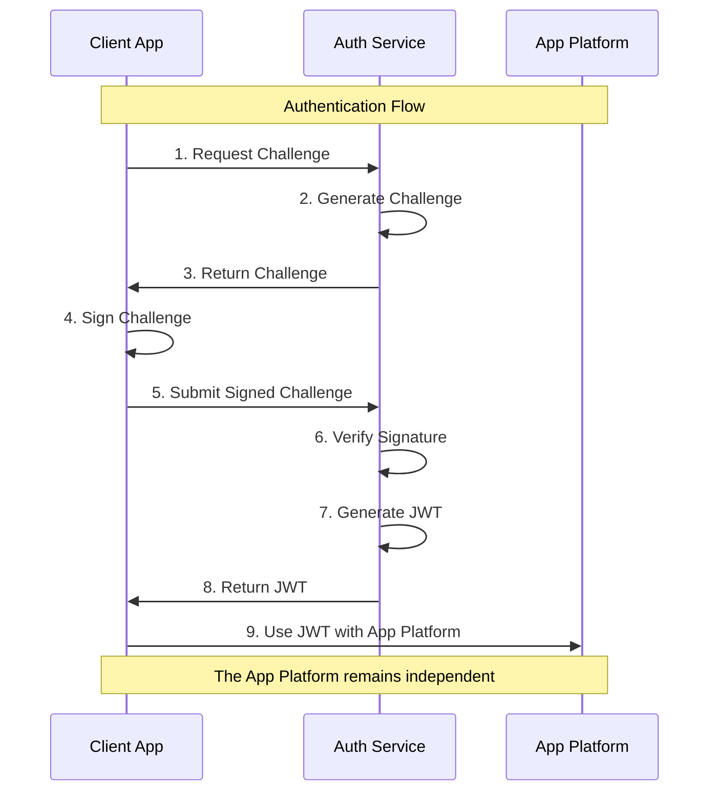

# Nostr Authentication Flow

This document describes the authentication flow in the Nostr Auth Middleware. For a comprehensive understanding of how this fits into the larger system architecture, please refer to our [Architecture Guide](architecture-guide.md).

## Architectural Context

The authentication flow is implemented as a standalone security service, following our core architectural principles:

```plaintext
┌─────────────────┐
│   Client App    │
└────────┬────────┘
         │
         ▼
┌─────────────────┐
│  Nostr Auth     │◄── You are here
│   Service       │
└────────┬────────┘
         │
         ▼
┌─────────────────┐
│  App Platform   │
└─────────────────┘
```

This isolation ensures:
- Clear security boundaries
- Auditable authentication code
- Protected application logic
- Scalable architecture

## Flow Diagram



## Detailed Steps

### 1. Frontend Initialization
```javascript
// Using nostr-tools in your frontend
import { getPublicKey, signEvent } from 'nostr-tools';

// Check if user has a Nostr extension (like nos2x or Alby)
const hasNostr = window.nostr !== undefined;
```

### 2. Request Challenge
```javascript
async function requestChallenge(pubkey) {
  const response = await fetch('http://your-api/auth/nostr/challenge', {
    method: 'POST',
    headers: {
      'Content-Type': 'application/json',
    },
    body: JSON.stringify({ pubkey }),
  });
  return await response.json();
}
```

### 3. Sign Challenge
```javascript
async function signChallenge(challengeEvent) {
  // The event will be signed by the user's Nostr extension
  const signedEvent = await window.nostr.signEvent({
    kind: 22242,
    created_at: Math.floor(Date.now() / 1000),
    tags: [
      ['challenge', challengeEvent.id],
    ],
    content: `nostr:auth:${challengeEvent.id}`,
  });
  return signedEvent;
}
```

### 4. Verify and Get Token
```javascript
async function verifySignature(challengeId, signedEvent) {
  const response = await fetch('http://your-api/auth/nostr/verify', {
    method: 'POST',
    headers: {
      'Content-Type': 'application/json',
    },
    body: JSON.stringify({
      challengeId,
      signedEvent,
    }),
  });
  return await response.json();
}
```

### 5. Complete Flow Example
```javascript
async function loginWithNostr() {
  try {
    // Get user's public key
    const pubkey = await window.nostr.getPublicKey();
    
    // Request challenge
    const { event: challengeEvent, challengeId } = await requestChallenge(pubkey);
    
    // Sign challenge
    const signedEvent = await signChallenge(challengeEvent);
    
    // Verify signature and get JWT token
    const { token, profile } = await verifySignature(challengeId, signedEvent);
    
    // Store token for future requests
    localStorage.setItem('authToken', token);
    
    // Use token in subsequent API calls
    const headers = {
      'Authorization': `Bearer ${token}`,
      'Content-Type': 'application/json',
    };
    
    return { token, profile };
  } catch (error) {
    console.error('Login failed:', error);
    throw error;
  }
}
```

## Server-Side Flow (Middleware)

1. **Challenge Generation**
   - Validates incoming pubkey
   - Creates a unique challenge event
   - Signs it with server's private key
   - Stores challenge temporarily

2. **Signature Verification**
   - Validates challenge existence and expiry
   - Verifies event signature
   - Checks event content and tags

3. **Token Generation**
   - Creates JWT token with user's pubkey
   - Configurable expiration time
   - Optional: Stores user profile in Supabase

## Security Considerations

1. **Private Key Management**
   - Development: Uses environment variables
   - Production: Stored securely in Supabase
   - Never expose private keys in client-side code

2. **Challenge Expiry**
   - Challenges expire after 5 minutes
   - Each challenge can only be used once
   - Prevents replay attacks

3. **JWT Token Security**
   - Short expiration time (configurable)
   - Contains minimal user data
   - Should be transmitted over HTTPS only

## Integration with Supabase

1. **User Profile Storage**
   ```sql
   -- Example Supabase table structure
   create table public.profiles (
     id uuid primary key default uuid_generate_v4(),
     pubkey text unique not null,
     name text,
     about text,
     picture text,
     enrolled_at timestamp with time zone default now()
   );
   ```

2. **Session Management**
   - JWT tokens can be validated against Supabase
   - User profiles are automatically created/updated
   - Supports multiple login methods per user

## Error Handling

1. **Common Errors**
   - No Nostr extension found
   - Challenge expired
   - Invalid signature
   - Network issues

2. **Error Responses**
   ```javascript
   {
     success: false,
     message: 'Detailed error message',
     code: 'ERROR_CODE'
   }
   ```

## Best Practices

1. **Frontend**
   - Always check for Nostr extension availability
   - Handle network errors gracefully
   - Implement token refresh mechanism
   - Store tokens securely

2. **Backend**
   - Use proper CORS configuration
   - Implement rate limiting
   - Monitor failed authentication attempts
   - Regular security audits

## Testing

The middleware includes test scripts to verify:
1. Challenge generation
2. Signature verification
3. Token generation
4. Profile management

Run tests using:
```bash
npm run test:live
