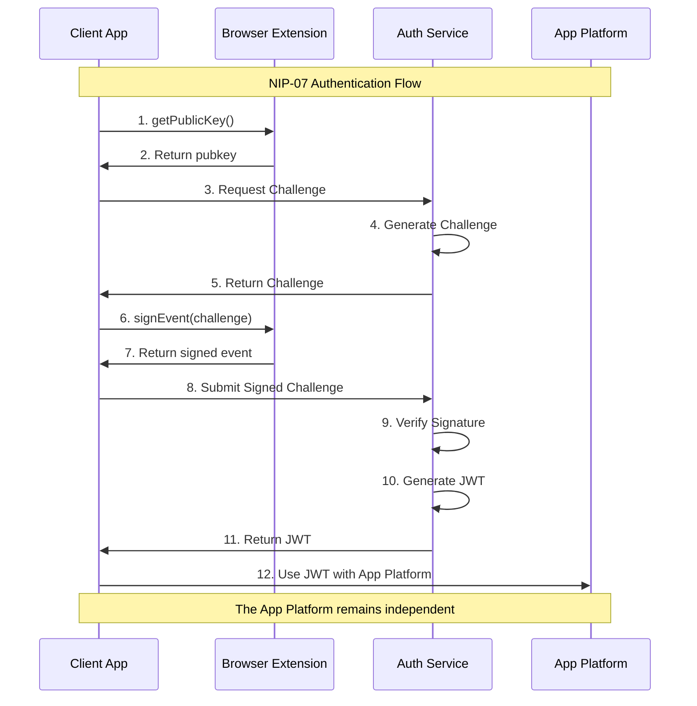
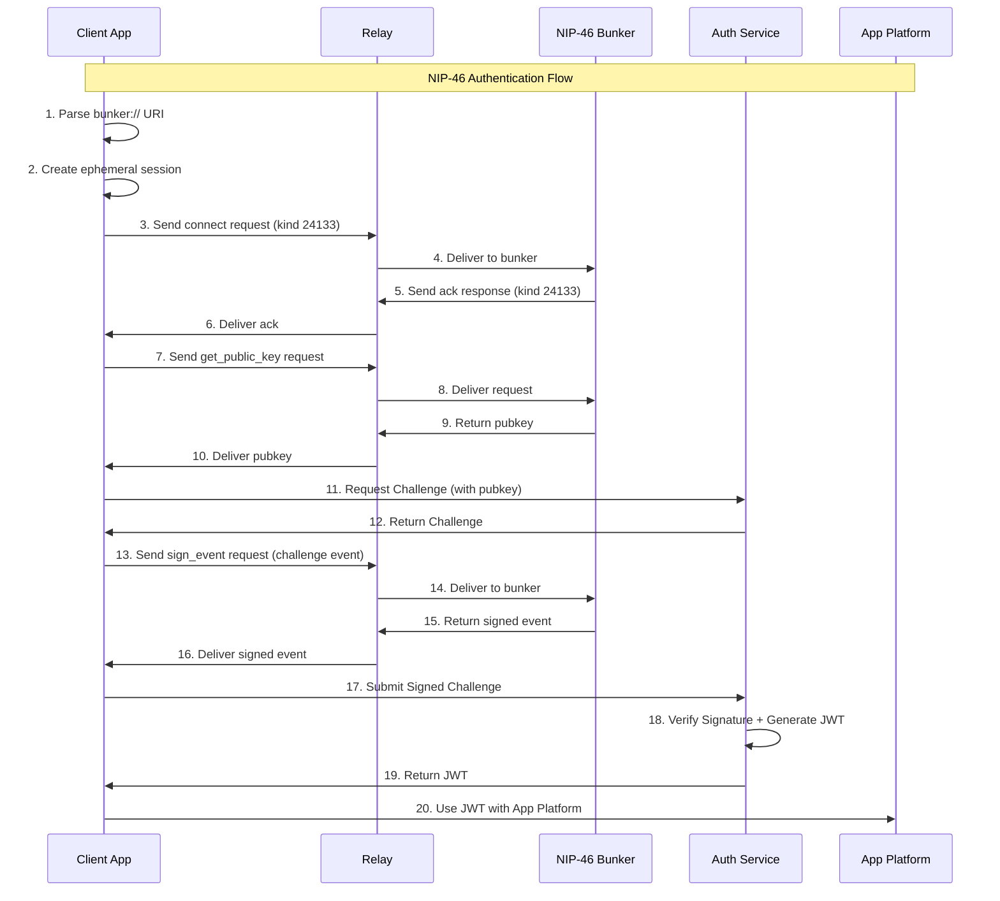
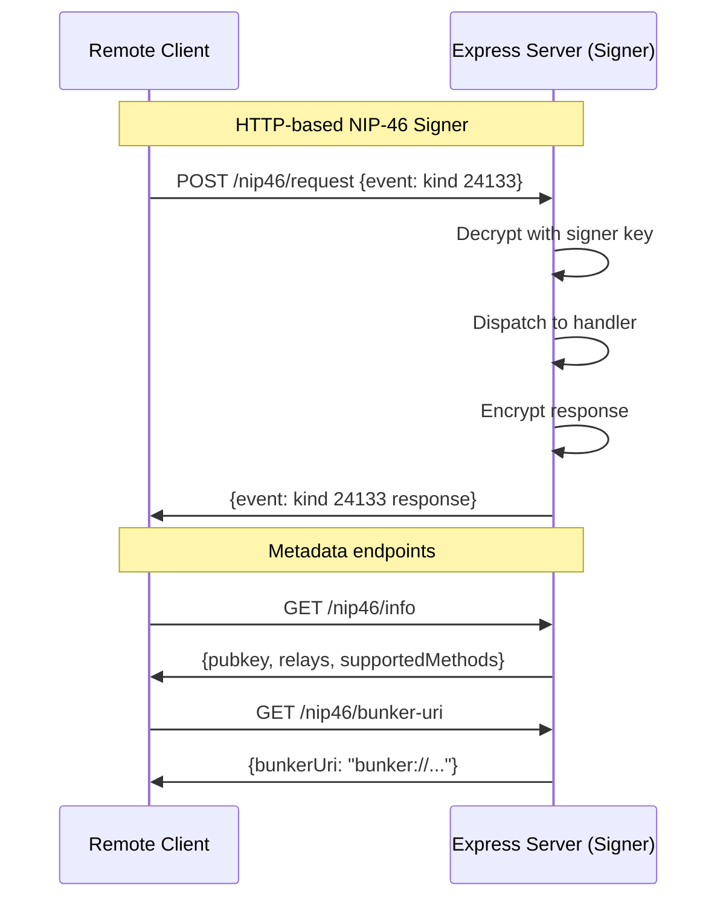

# Nostr Authentication Flow

This document describes the authentication flows in the Nostr Auth Middleware. The middleware supports two protocols:

- **NIP-07** — Browser extension authentication via `window.nostr`
- **NIP-46** — Remote signer / bunker authentication via encrypted kind 24133 events

For a comprehensive understanding of how this fits into the larger system architecture, please refer to our [Architecture Guide](architecture-guide.md).

## Architectural Context

The authentication flow is implemented as a standalone security service, following our core architectural principles:

```plaintext
┌─────────────────┐
│   Client App    │
└────────┬────────┘
         │
         ▼
┌─────────────────┐
│  Nostr Auth     │◄── You are here
│   Service       │
└────────┬────────┘
         │
         ▼
┌─────────────────┐
│  App Platform   │
└─────────────────┘
```

This isolation ensures:
- Clear security boundaries
- Auditable authentication code
- Protected application logic
- Scalable architecture

## NIP-07 Flow Diagram


```mermaid
sequenceDiagram
    participant C as Client App
    participant E as Browser Extension
    participant A as Auth Service
    participant P as App Platform

    Note over C,P: NIP-07 Authentication Flow
    C->>E: 1. getPublicKey()
    E->>C: 2. Return pubkey
    C->>A: 3. Request Challenge
    A->>A: 4. Generate Challenge
    A->>C: 5. Return Challenge
    C->>E: 6. signEvent(challenge)
    E->>C: 7. Return signed event
    C->>A: 8. Submit Signed Challenge
    A->>A: 9. Verify Signature
    A->>A: 10. Generate JWT
    A->>C: 11. Return JWT
    C->>P: 12. Use JWT with App Platform

    Note over C,P: The App Platform remains independent
```

## NIP-46 Flow Diagram


```mermaid
sequenceDiagram
    participant C as Client App
    participant R as Relay
    participant B as NIP-46 Bunker
    participant A as Auth Service
    participant P as App Platform

    Note over C,P: NIP-46 Authentication Flow
    C->>C: 1. Parse bunker:// URI
    C->>C: 2. Create ephemeral session
    C->>R: 3. Send connect request (kind 24133)
    R->>B: 4. Deliver to bunker
    B->>R: 5. Send ack response (kind 24133)
    R->>C: 6. Deliver ack
    C->>R: 7. Send get_public_key request
    R->>B: 8. Deliver request
    B->>R: 9. Return pubkey
    R->>C: 10. Deliver pubkey
    C->>A: 11. Request Challenge (with pubkey)
    A->>C: 12. Return Challenge
    C->>R: 13. Send sign_event request (challenge event)
    R->>B: 14. Deliver to bunker
    B->>R: 15. Return signed event
    R->>C: 16. Deliver signed event
    C->>A: 17. Submit Signed Challenge
    A->>A: 18. Verify Signature + Generate JWT
    A->>C: 19. Return JWT
    C->>P: 20. Use JWT with App Platform
```

## NIP-46 Signer Middleware Flow (Server as Signer)


```mermaid
sequenceDiagram
    participant C as Remote Client
    participant A as Express Server (Signer)

    Note over C,A: HTTP-based NIP-46 Signer
    C->>A: POST /nip46/request {event: kind 24133}
    A->>A: Decrypt with signer key
    A->>A: Dispatch to handler
    A->>A: Encrypt response
    A->>C: {event: kind 24133 response}

    Note over C,A: Metadata endpoints
    C->>A: GET /nip46/info
    A->>C: {pubkey, relays, supportedMethods}
    C->>A: GET /nip46/bunker-uri
    A->>C: {bunkerUri: "bunker://..."}
```

## Detailed Steps (NIP-07)

### 1. Frontend Initialization
```javascript
// Using nostr-tools in your frontend
import { getPublicKey, signEvent } from 'nostr-tools';

// Check if user has a Nostr extension (like nos2x or Alby)
const hasNostr = window.nostr !== undefined;
```

### 2. Request Challenge
```javascript
async function requestChallenge(pubkey) {
  const response = await fetch('http://your-api/auth/nostr/challenge', {
    method: 'POST',
    headers: {
      'Content-Type': 'application/json',
    },
    body: JSON.stringify({ pubkey }),
  });
  return await response.json();
}
```

### 3. Sign Challenge
```javascript
async function signChallenge(challengeEvent) {
  // The event will be signed by the user's Nostr extension
  const signedEvent = await window.nostr.signEvent({
    kind: 22242,
    created_at: Math.floor(Date.now() / 1000),
    tags: [
      ['challenge', challengeEvent.id],
    ],
    content: `nostr:auth:${challengeEvent.id}`,
  });
  return signedEvent;
}
```

### 4. Verify and Get Token
```javascript
async function verifySignature(challengeId, signedEvent) {
  const response = await fetch('http://your-api/auth/nostr/verify', {
    method: 'POST',
    headers: {
      'Content-Type': 'application/json',
    },
    body: JSON.stringify({
      challengeId,
      signedEvent,
    }),
  });
  return await response.json();
}
```

### 5. Complete Flow Example
```javascript
async function loginWithNostr() {
  try {
    // Get user's public key
    const pubkey = await window.nostr.getPublicKey();
    
    // Request challenge
    const { event: challengeEvent, challengeId } = await requestChallenge(pubkey);
    
    // Sign challenge
    const signedEvent = await signChallenge(challengeEvent);
    
    // Verify signature and get JWT token
    const { token, profile } = await verifySignature(challengeId, signedEvent);
    
    // Store token for future requests
    localStorage.setItem('authToken', token);
    
    // Use token in subsequent API calls
    const headers = {
      'Authorization': `Bearer ${token}`,
      'Content-Type': 'application/json',
    };
    
    return { token, profile };
  } catch (error) {
    console.error('Login failed:', error);
    throw error;
  }
}
```

## Detailed Steps (NIP-46)

### 1. Initialize with Bunker URI
```typescript
import { Nip46AuthHandler } from 'nostr-auth-middleware/browser';

const auth = new Nip46AuthHandler({
  bunkerUri: 'bunker://<remote-pubkey>?relay=wss://relay.example.com&secret=mysecret',
  serverUrl: 'https://auth.example.com',
});
```

### 2. Provide Transport
```typescript
// Your relay library provides the transport
auth.setTransport({
  sendEvent: async (event) => {
    await relay.publish(event);
  },
  subscribe: (filter, onEvent) => {
    const sub = relay.subscribe([filter]);
    sub.on('event', onEvent);
    return () => sub.unsub();
  },
});
```

### 3. Connect to Remote Signer
```typescript
await auth.connect();
// Sends 'connect' request via kind 24133 event
// Waits for 'ack' response from the bunker
```

### 4. Authenticate
```typescript
const result = await auth.authenticate();
// 1. Asks bunker for pubkey (get_public_key)
// 2. Fetches challenge from server
// 3. Asks bunker to sign challenge event (sign_event)
// 4. Submits signed event to server for JWT

console.log(result.pubkey);       // User's identity
console.log(result.signedEvent);  // The signed challenge
console.log(result.sessionInfo);  // { clientPubkey, remotePubkey }
```

### 5. Complete NIP-46 Login Flow
```typescript
async function loginWithBunker(bunkerUri) {
  try {
    const auth = new Nip46AuthHandler({
      bunkerUri,
      serverUrl: 'https://auth.example.com',
    });

    auth.setTransport(myRelayTransport);
    await auth.connect();
    const { pubkey, signedEvent } = await auth.authenticate();

    // Store session
    localStorage.setItem('authPubkey', pubkey);

    return { pubkey };
  } catch (error) {
    if (error.message.includes('timed out')) {
      // Remote signer didn't respond
    } else if (error.message.includes('invalid secret')) {
      // Wrong connection secret
    }
    throw error;
  }
}
```

## Server-Side Flow (Middleware)

1. **Challenge Generation**
   - Validates incoming pubkey
   - Creates a unique challenge event
   - Signs it with server's private key
   - Stores challenge temporarily

2. **Signature Verification**
   - Validates challenge existence and expiry
   - Verifies event signature
   - Checks event content and tags

3. **Token Generation**
   - Creates JWT token with user's pubkey
   - Configurable expiration time
   - Optional: Stores user profile in Supabase

## Server-Side NIP-46 Signer

If your Express server needs to act as a NIP-46 signer (accepting remote signing requests):

```typescript
import express from 'express';
import { createNip46Signer } from 'nostr-auth-middleware';

const app = express();
app.use(express.json());

const signer = createNip46Signer(
  {
    signerSecretKey: process.env.SIGNER_SECRET_KEY,
    relays: ['wss://relay.example.com'],
    secret: process.env.BUNKER_SECRET,
    sessionTimeoutMs: 3600000, // 1 hour
  },
  {
    getPublicKey: () => myPublicKey,
    signEvent: async (eventJson) => {
      const event = JSON.parse(eventJson);
      const signed = await signWithMyKey(event);
      return JSON.stringify(signed);
    },
    // Optional NIP-44 handlers
    nip44Encrypt: async (pubkey, plaintext) => { /* ... */ },
    nip44Decrypt: async (pubkey, ciphertext) => { /* ... */ },
  }
);

// Mount routes: POST /request, GET /info, GET /bunker-uri
app.use('/nip46', signer.getRouter());

// Clean up on shutdown
process.on('SIGTERM', () => signer.destroy());
```

### Session Management

The signer middleware tracks authenticated clients in memory:
- Clients must send a `connect` request before other methods
- Sessions expire after `sessionTimeoutMs` (default: 1 hour)
- Expired sessions are cleaned up every 60 seconds
- `ping` is always allowed (even without authentication)

## Security Considerations

1. **Private Key Management**
   - Development: Uses environment variables
   - Production: Stored securely in Supabase
   - Never expose private keys in client-side code

2. **Challenge Expiry**
   - Challenges expire after 5 minutes
   - Each challenge can only be used once
   - Prevents replay attacks

3. **JWT Token Security**
   - Short expiration time (configurable)
   - Contains minimal user data
   - Should be transmitted over HTTPS only

## Integration with Supabase

1. **User Profile Storage**
   ```sql
   -- Example Supabase table structure
   create table public.profiles (
     id uuid primary key default uuid_generate_v4(),
     pubkey text unique not null,
     name text,
     about text,
     picture text,
     enrolled_at timestamp with time zone default now()
   );
   ```

2. **Session Management**
   - JWT tokens can be validated against Supabase
   - User profiles are automatically created/updated
   - Supports multiple login methods per user

## Error Handling

1. **Common Errors**
   - No Nostr extension found
   - Challenge expired
   - Invalid signature
   - Network issues

2. **Error Responses**
   ```javascript
   {
     success: false,
     message: 'Detailed error message',
     code: 'ERROR_CODE'
   }
   ```

## Best Practices

1. **Frontend**
   - Always check for Nostr extension availability
   - Handle network errors gracefully
   - Implement token refresh mechanism
   - Store tokens securely

2. **Backend**
   - Use proper CORS configuration
   - Implement rate limiting
   - Monitor failed authentication attempts
   - Regular security audits

## Testing

The middleware includes test scripts to verify:
1. Challenge generation
2. Signature verification
3. Token generation
4. Profile management

Run tests using:
```bash
npm run test:live
